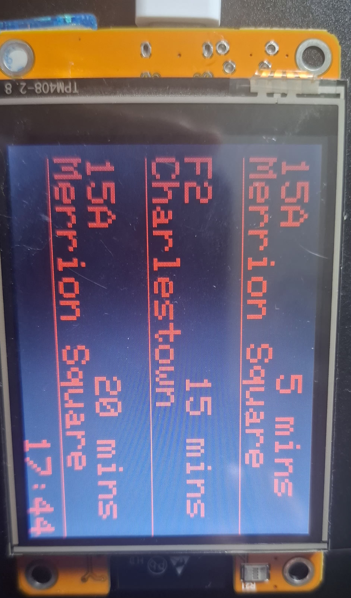
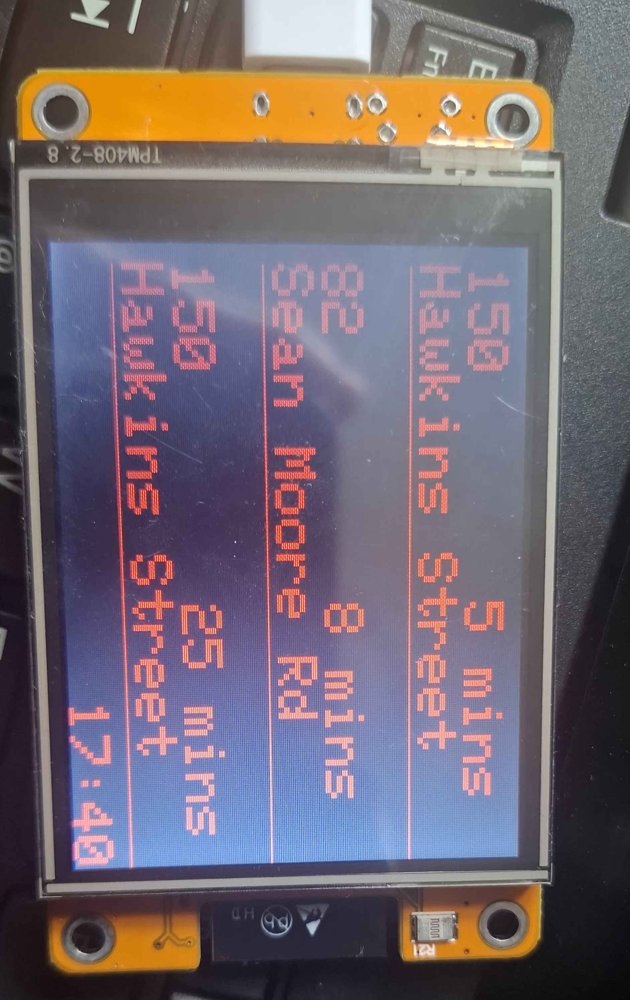
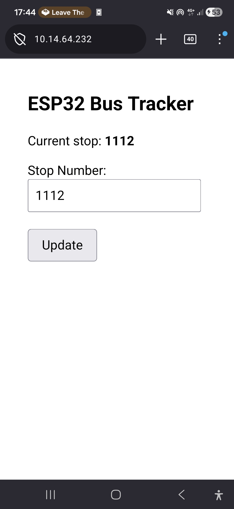
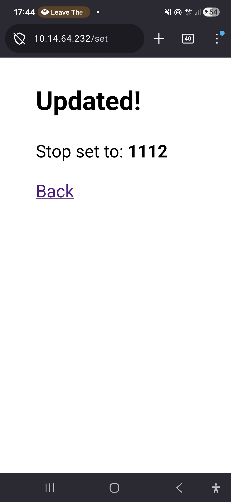

# Esp32-Bus-Times

An overengineered solution to bus times written in C++ for the Esp32 using a "CYD" - cheap yellow display 
- uses the tfi live api to get times for busses for a specified stop
- hosts a web server to allow the user to change what bus stop they want to track
- displays the current time in 24 hour

--- 
# images 

## device 
 

 

## Web Server 

 
 

--- 
# Usage / instalation 

- Clone repository
- install required libraries "ArduinoJSON.h" and "TFT_eSPI.h"
- flash the files with the **ArduinoIDE** 
- Use Webserver to set stop number to your Bus stop 

*Note as i used an Esp32 cyd my code may not work on all other esp32 cyd modules as they have different pin layouts and drivers so there may be issues with display code for some users, and may need to edit their User_setup.h file to allow their display to work with the code*
